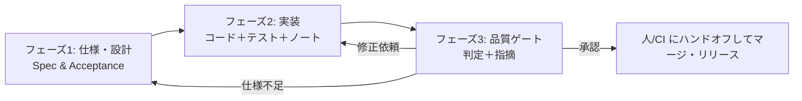

# Claude Code マルチエージェントワークフロー

このコマンドで、$ARGUMENTS を対象に仕様策定→実装→品質ゲートを順に実施します。  
メインエージェントは各サブエージェントを明示的に呼び出し、出力は簡潔で実行可能な形にまとめてください（ネスト委譲なし）。

## ワークフロー図 (Mermaid)

## オーケストレーションステップ

### フェーズ1: 仕様・設計
**spec-design-agent-ja** サブエージェントを使い、$ARGUMENTS を構造化された仕様に落とし込む。  
出力: 「Spec & Acceptance」セクション（スコープ/非スコープ、制約、API/データ草案、非機能要件、受け入れ条件チェックリストを含める）。

### フェーズ2: 実装
**delivery-agent-ja** サブエージェントを使い、SDA 出力に沿って実装を行う。  
出力: 「Delivery」セクション（実装サマリ、実行/推奨テストコマンド、デプロイ/運用ノート、未解決の質問や前提）。

### フェーズ3: 品質ゲート
**quality-gate-agent-ja** サブエージェントを使い、DA の成果物をレビューしゲート判定を行う。  
出力: 「Quality Gate」セクション（重大度付き指摘とファイル/行、不足テスト、ゲート判定: approve / request changes / conditional + 必須アクション、残リスク）。

## 完了条件
- 仕様と受け入れ条件がリクエストとトレースできる形で出力されている。
- 実装サマリとテストコマンドが提示されている。
- 品質ゲートの指摘と判定、必要な次アクションが明示されている。
- ゲート未承認の場合は担当/アクションが明確。
