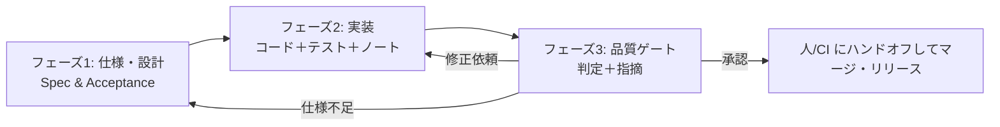
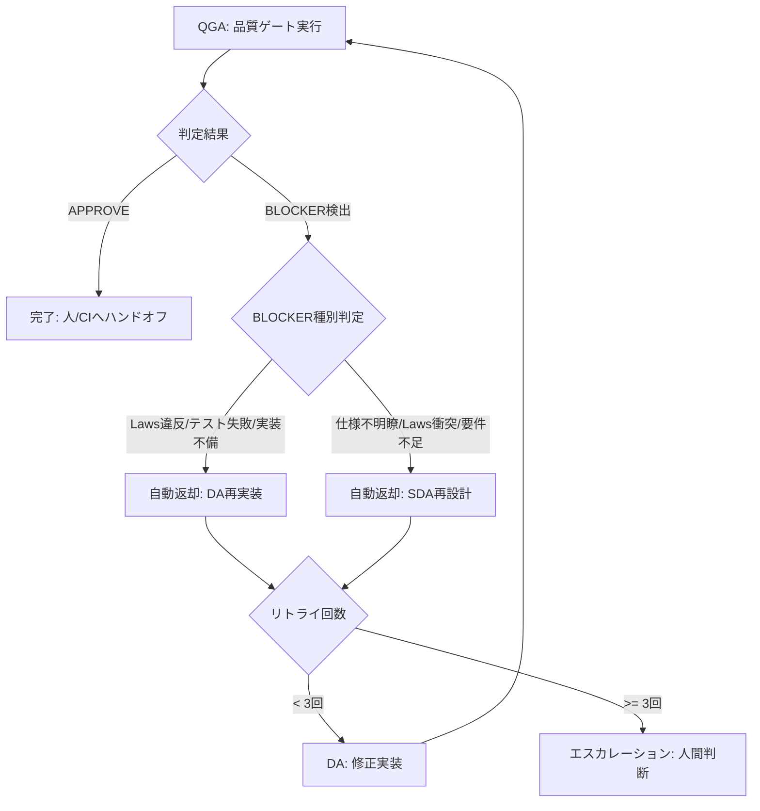

# Claude Code マルチエージェントワークフロー

このコマンドで、$ARGUMENTS を対象に仕様策定→実装→品質ゲートを順に実施します。  
メインエージェントは各サブエージェントを明示的に呼び出し、出力は簡潔で実行可能な形にまとめてください（ネスト委譲なし）。

## ワークフロー図 (Mermaid)


```mermaid
flowchart LR
  A[フェーズ1: 仕様・設計<br/>Spec & Acceptance] --> B[フェーズ2: 実装<br/>コード＋テスト＋ノート]
  B --> C[フェーズ3: 品質ゲート<br/>判定＋指摘]
  C -->|修正依頼| B
  C -->|仕様不足| A
  C -->|承認| D[人/CI にハンドオフしてマージ・リリース]
```

## オーケストレーションステップ

### フェーズ1: 仕様・設計

**spec-design-agent-ja** サブエージェントを使い、$ARGUMENTS を構造化された仕様に落とし込む。  
出力: 「Spec & Acceptance」セクション（スコープ/非スコープ、制約、API/データ草案、非機能要件、受け入れ条件チェックリストを含める）。

### フェーズ2: 実装

**delivery-agent-ja** サブエージェントを使い、SDA 出力に沿って実装を行う。  
出力: 「Delivery」セクション（実装サマリ、実行/推奨テストコマンド、デプロイ/運用ノート、未解決の質問や前提）。

### フェーズ3: 品質ゲート

**quality-gate-agent-ja** サブエージェントを使い、DA の成果物をレビューしゲート判定を行う。  
出力: 「Quality Gate」セクション（重大度付き指摘とファイル/行、不足テスト、ゲート判定: approve / request changes / conditional + 必須アクション、残リスク）。

## 完了条件

- 仕様と受け入れ条件がリクエストとトレースできる形で出力されている。
- 実装サマリとテストコマンドが提示されている。
- 品質ゲートの指摘と判定、必要な次アクションが明示されている。
- ゲート未承認の場合は担当/アクションが明確。

## フローバック自動化ロジック

### 自動処理フロー


```mermaid
flowchart TD
  QGA[QGA: 品質ゲート実行]
  QGA --> CHECK{判定結果}

  CHECK -->|APPROVE| DONE[完了: 人/CIへハンドオフ]
  CHECK -->|BLOCKER検出| COUNT{BLOCKER種別判定}

  COUNT -->|Laws違反/テスト失敗/実装不備| DA_RETURN[自動返却: DA再実装]
  COUNT -->|仕様不明瞭/Laws衝突/要件不足| SDA_RETURN[自動返却: SDA再設計]

  DA_RETURN --> RETRY_CHECK{リトライ回数}
  SDA_RETURN --> RETRY_CHECK

  RETRY_CHECK -->|< 3回| DA[DA: 修正実装]
  RETRY_CHECK -->|>= 3回| ESCALATE[エスカレーション: 人間判断]

  DA --> QGA
```

### リトライループ管理

ワークフロー状態を管理し、無限ループを防止：

```typescript
interface WorkflowState {
  iteration: number;
  max_iterations: 3;
  phase_history: PhaseResult[];
  blocker_history: BlockerIssue[];
}

interface PhaseResult {
  phase: "SDA" | "DA" | "QGA";
  timestamp: string;
  status: "SUCCESS" | "RETURNED" | "ESCALATED";
  return_reason?: string;
  blocker_count?: number;
}

interface BlockerIssue {
  id: string;
  law: string;
  severity: "BLOCKER" | "MAJOR";
  first_detected: string;
  retry_count: number;
  resolved: boolean;
}
```

### ループ制御ルール

1. **同一BLOCKER 2回繰り返し** → エスカレーション
2. **総リトライ回数 >= 3** → エスカレーション
3. **エスカレーション時の報告**:

```markdown
🚨 ワークフロー・エスカレーション

理由: 同一BLOCKER（L-SC-004 レート制限未実装）が2回検出
試行履歴:

- Iteration 1: DA実装 → QGA検出（BLOCKER-001）
- Iteration 2: DA修正 → QGA再検出（同一BLOCKER-001）

根本原因分析:

- DAがレート制限の実装方法を理解していない可能性
- または、仕様（SDA）がレート制限の具体的実装手順を欠いている

推奨アクション:

1. SDAフェーズへ返却し、レート制限実装の詳細仕様を追加
2. または、人間開発者がDA実装をレビュー
3. Laws L-SC-004の実装例を参照資料として追加

ユーザー判断を依頼します。
```

### 自動フローバック実行

QGA判定が `REQUEST_CHANGES` かつ `auto_return: true` の場合、以下のロジックで自動返却：

**判定基準:**

- `return_to: DA` → DAフェーズへ返却（Laws違反、テスト失敗、実装不備）
- `return_to: SDA` → SDAフェーズへ返却（仕様不明瞭、Laws衝突、要件不足）

**実行手順:**

1. QGA Gate Decisionから `return_to` と `auto_return` を抽出
2. `auto_return: true` の場合、該当フェーズを自動再実行
3. リトライカウントを増加（iteration++）
4. リトライ上限（3回）またはBLOCKER重複判定
5. 条件超過時はエスカレーション報告を出力し、ユーザー判断待ち

**疑似コード:**

```bash
if [[ $GATE_STATUS == "REQUEST_CHANGES" ]] && [[ $AUTO_RETURN == "true" ]]; then
  RETURN_TO=$(extract_return_target)  # "DA" or "SDA"
  BLOCKER_IDS=$(list_blocker_ids)

  echo "🔄 自動フローバック: $RETURN_TO へ返却"
  echo "理由: $(list_blockers)"

  # リトライ管理
  ITERATION=$((ITERATION + 1))

  # 同一BLOCKER検出チェック
  if check_duplicate_blocker "$BLOCKER_IDS" "$PREVIOUS_BLOCKERS"; then
    echo "⚠️ 同一BLOCKER繰り返し検出"
    escalate_to_human
    exit 1
  fi

  # リトライ上限チェック
  if [[ $ITERATION -ge 3 ]]; then
    echo "⚠️ リトライ上限到達（3回）"
    escalate_to_human
    exit 1
  fi

  # フェーズ再実行
  restart_phase "$RETURN_TO" "$ITERATION"
else
  echo "✅ ゲート判定完了: $GATE_STATUS"
fi
```

### エスカレーション条件

以下の条件で人間判断を要求：

1. **同一BLOCKERが2回以上検出**
   - 例: L-SC-004が Iteration 1 と Iteration 2 で同じIDで検出
   - 原因: DAがルール理解不足、またはSDA仕様不足

2. **総リトライ回数が3回に到達**
   - 例: DA → QGA → DA → QGA → DA → QGA（3回目）
   - 原因: 複数のBLOCKERが連続発生、または修正が困難

3. **SPEC_GAP判定後のSDA返却が2回以上**
   - 例: DA → QGA → SDA → DA → QGA → SDA（2回目）
   - 原因: 仕様策定プロセスに根本的な問題

エスカレーション時は、上記「エスカレーション報告」フォーマットで状況を整理し、ユーザーに判断を委ねる。
