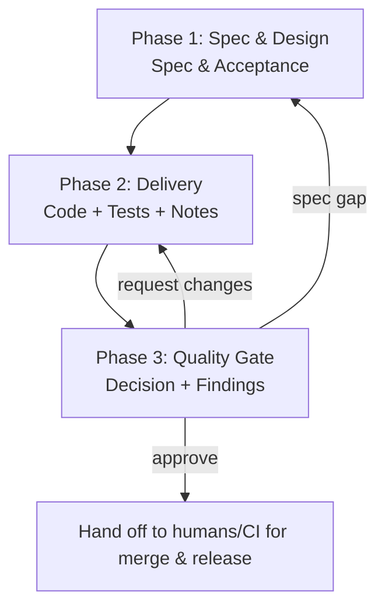

# Claude Code Multi-Agent Workflow

Run this command to execute a full coding cycle in Claude Code for: $ARGUMENTS  
Main agent must call each subagent directly (no nested delegation) and keep outputs concise and actionable.

## Workflow Map (Mermaid)

## Orchestration Steps

### Phase 1: Specification & Design
Use the **spec-design-agent** subagent to turn $ARGUMENTS into a structured spec.  
Output: Markdown section titled "Spec & Acceptance" covering scope/non-goals, constraints, API/data sketches, non-functional needs, and an acceptance-criteria checklist mapped to the work.

### Phase 2: Delivery & Implementation
Use the **delivery-agent** subagent to implement according to the SDA output.  
Output: Markdown section titled "Delivery" with code changes summary, commands/tests run (or to run), deployment/runbook notes, and any blocking questions/assumptions.

### Phase 3: Quality Gate
Use the **quality-gate-agent** subagent to review the DA work against the SDA spec.  
Output: Markdown section titled "Quality Gate" listing findings with severities and file/line refs, missing/weak tests, gate decision (approve / request changes / conditional + required actions), and residual risks.

## Completion Criteria
- Spec & acceptance criteria produced and traceable to the request.
- Delivery summarizes implemented changes and test commands.
- Quality Gate delivers a gate decision plus concrete review notes.
- Next steps or assignments are explicit if the gate is not approved.
