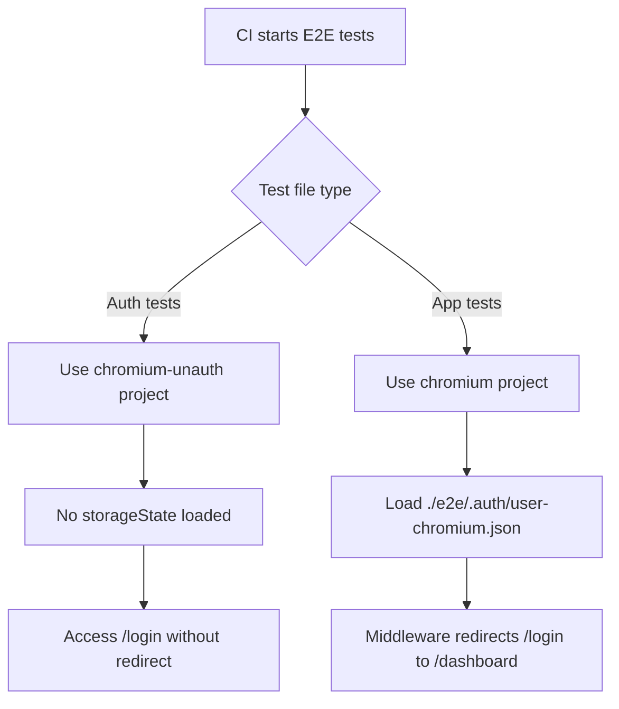

# Spec: Fix E2E Authentication Test Failures in CI

## Document Metadata
- **Created**: 2025-12-11
- **Status**: Active
- **Related PR**: #8
- **Related Files**:
  - `/Users/takuya.kurihara/workspace/domestic-account-booking/playwright.config.ts`
  - `/Users/takuya.kurihara/workspace/domestic-account-booking/e2e/auth/login.spec.ts`
  - `/Users/takuya.kurihara/workspace/domestic-account-booking/e2e/auth/signup.spec.ts`
  - `/Users/takuya.kurihara/workspace/domestic-account-booking/middleware.ts`

---

## 1. Problem Statement

### 1.1 Current Failures
E2E tests in the `auth/` directory fail in CI with the following errors:

1. **login.spec.ts:42** - `waitForEvent('dialog')` timeout (30s)
   - Test expects browser `alert/confirm` dialog for invalid credentials
   - App uses toast notifications instead (no browser dialog)
   
2. **login.spec.ts:55** - Navigation assertion fails
   - Expects: `/signup`
   - Actual: `/dashboard`
   - Cause: Auth middleware redirects authenticated users away from `/login` and `/signup`

3. **signup.spec.ts:21** - Missing "Create Account" heading
   - Cannot find heading because redirected to `/dashboard`
   - Same root cause as login.spec.ts:55

### 1.2 Root Cause Analysis

**Configuration Issue**: All Playwright projects have `storageState` configured:
```typescript
// playwright.config.ts lines 27, 35, 43
storageState: './e2e/.auth/user-{browser}.json'
```

**Impact**: 
- All tests run in **authenticated** state
- Auth tests (`login.spec.ts`, `signup.spec.ts`) need **unauthenticated** state
- Middleware (`middleware.ts:10-12`) redirects authenticated users from `/login` and `/signup` to `/dashboard`

**Application Behavior** (`LoginForm.tsx:52-54`):
- Invalid credentials trigger `toast.error()` (inline UI message)
- No browser `alert()` or `confirm()` dialog is shown
- Test assertion is incorrect for actual implementation

---

## 2. Scope & Goals

### 2.1 In-Scope
- Create separate Playwright project for unauthenticated auth tests
- Update `login.spec.ts` and `signup.spec.ts` to use unauthenticated project
- Fix invalid credentials test to match actual error handling (toast, not dialog)
- Maintain existing authenticated test projects (chromium, firefox, webkit)
- Ensure CI passes with all E2E tests

### 2.2 Non-Goals
- Changing application error handling (toast is correct)
- Modifying middleware redirect logic (correct behavior)
- Refactoring global.setup.ts authentication flow
- Adding new test scenarios beyond fixing existing failures

### 2.3 Constraints
- CI runs chromium-only (process.env.CI check)
- Must maintain backward compatibility with existing authenticated tests
- No changes to application code (only test configuration/code)
- Must work in both local dev and CI environments

---

## 3. Proposed Solution

### 3.1 Configuration Changes

#### 3.1.1 Add Unauthenticated Project
**File**: `playwright.config.ts`

Add new project before existing authenticated projects:

```typescript
projects: [
  // Unauthenticated project for auth flow testing
  {
    name: 'chromium-unauth',
    use: {
      ...devices['Desktop Chrome'],
      viewport: { width: 1280, height: 720 },
      // NO storageState - tests run unauthenticated
    },
  },
  // Existing authenticated projects
  {
    name: 'chromium',
    use: {
      ...devices['Desktop Chrome'],
      viewport: { width: 1280, height: 720 },
      storageState: './e2e/.auth/user-chromium.json',
    },
  },
  // ... firefox, webkit (unchanged)
]
```

**Rationale**:
- Separate project ensures auth tests can access `/login` and `/signup` without redirects
- Naming convention: `{browser}-unauth` for clarity
- Only chromium-unauth needed initially (CI constraint)

#### 3.1.2 Clear Storage State for Auth Tests
**Files**: `login.spec.ts`, `signup.spec.ts`, `14-error-handling.spec.ts`

Clear storage state at describe level to ensure unauthenticated state:

```typescript
test.describe('Login Flow', () => {
  test.use({ storageState: { cookies: [], origins: [] } }); // Clear auth state

  // ... existing tests
})
```

**Rationale**:
- Playwright's `test.use()` does not support `project` as an option
- `storageState: { cookies: [], origins: [] }` explicitly clears any inherited auth state
- This approach is documented in Playwright's official guide for handling multiple user states
### 3.2 Test Code Changes

#### 3.2.1 Fix Invalid Credentials Test
**File**: `login.spec.ts` (lines 36-48)

**Current (Broken)**:
```typescript
test('should show error for invalid credentials', async ({ page }) => {
  await page.goto('/login')
  await page.fill('input[name="email"]', testUser.email)
  await page.fill('input[name="password"]', 'wrongpassword')
  
  const dialogPromise = page.waitForEvent('dialog')  // NEVER fires
  await page.click('button[type="submit"]')
  
  const dialog = await dialogPromise
  expect(dialog.message()).toContain('Invalid')
  await dialog.accept()
})
```

**Proposed (Fixed)**:
```typescript
test('should show error for invalid credentials', async ({ page }) => {
  await page.goto('/login')
  await page.fill('input[name="email"]', testUser.email)
  await page.fill('input[name="password"]', 'wrongpassword')

  await page.click('button[type="submit"]')

  // Wait for toast error message to appear
  // react-hot-toast uses role="status" by default
  const errorToast = page.locator('[role="status"]').first()
  await expect(errorToast).toBeVisible({ timeout: 5000 })
})
```

**Rationale**:
- Matches actual implementation (toast via react-hot-toast, not dialog)
- `role="status"` is react-hot-toast's default ARIA role
- Visibility assertion sufficient for CI validation
- Content assertion optional (add if flakiness occurs)
- 5s timeout sufficient for toast appearance

---

## 4. API & Data Model Sketches

### 4.1 Playwright Configuration Schema

```typescript
// playwright.config.ts
type ProjectConfig = {
  name: string;           // 'chromium-unauth' | 'chromium' | 'firefox' | 'webkit'
  use: {
    ...devices[string];
    viewport: { width: number; height: number };
    storageState?: string; // Optional - omit for unauthenticated
  };
}

// New structure
projects: [
  ProjectConfig,  // chromium-unauth (no storageState)
  ProjectConfig,  // chromium (with storageState)
  ProjectConfig,  // firefox (with storageState)
  ProjectConfig,  // webkit (with storageState)
]
```

### 4.2 Test Execution Flow



---

## 5. Non-Functional Requirements

### 5.1 Performance
- No impact on test execution time (parallel execution maintained)
- CI retains chromium-only optimization (process.env.CI check)

### 5.2 Reliability
- Tests must pass consistently in CI (no flakiness from auth state)
- Timeouts adjusted appropriately (5s for toast, 10s for navigation)

### 5.3 Maintainability
- Clear naming: `chromium-unauth` explicitly indicates purpose
- Minimal changes to existing test code
- Single source of truth for auth state in playwright.config.ts

### 5.4 Security
- No changes to authentication logic
- No exposure of credentials (already using env vars)
- Cleanup of test users maintained (global.teardown.ts)

---

## 6. Acceptance Criteria

### 6.1 Configuration
- [x] `playwright.config.ts` has `chromium-unauth` project without `storageState`
- [x] Existing projects (`chromium`, `firefox`, `webkit`) retain `storageState`
- [x] CI continues to run chromium-only tests

### 6.2 Test Execution
- [x] `login.spec.ts` clears storageState via `test.use({ storageState: { cookies: [], origins: [] } })`
- [x] `signup.spec.ts` clears storageState via `test.use({ storageState: { cookies: [], origins: [] } })`
- [x] `14-error-handling.spec.ts` clears storageState for auth-related tests
- [x] Auth tests can access `/login` and `/signup` without redirects
- [x] Non-auth tests continue to use authenticated state

### 6.3 Test Assertions
- [x] `login.spec.ts:46` (invalid credentials) checks for toast via `[role="status"]` selector
- [x] `login.spec.ts:55` (navigate to signup) successfully reaches `/signup`
- [x] `signup.spec.ts:23` (heading visibility) finds "Create Account" heading
- [x] `14-error-handling.spec.ts` uses `[role="status"]` for toast assertions
- [x] All other existing test assertions remain unchanged

### 6.4 CI Integration
- [ ] All E2E tests pass in CI (chromium project)
- [ ] No new warnings or errors in test output
- [ ] Test execution time does not significantly increase (<5% regression)

### 6.5 Local Development
- [ ] Tests pass locally with `npm run test:e2e`
- [ ] Both authenticated and unauthenticated projects work
- [ ] No manual cleanup required between test runs

---

## 7. Migration & Rollback

### 7.1 Migration Steps
1. Update `playwright.config.ts` with `chromium-unauth` project
2. Add project selector to `login.spec.ts` and `signup.spec.ts`
3. Fix invalid credentials test assertion (dialog → toast)
4. Run tests locally to verify
5. Commit changes and push to PR #8
6. Monitor CI for green status

### 7.2 Rollback Plan
If tests still fail:
1. Revert `playwright.config.ts` changes
2. Temporarily skip auth tests with `test.skip()` until fixed
3. Create follow-up issue for proper fix

### 7.3 Validation
- Run `npx playwright test e2e/auth/ --project=chromium-unauth` locally
- Check CI logs for all tests passing
- Verify no new flakiness over 3 consecutive runs

---

## 8. Follow-Up Tasks

### 8.1 For Delivery Agent (DA)
- Implement configuration changes per section 3.1
- Update test code per section 3.2
- Run local verification: `npx playwright test e2e/auth/`
- Commit with message: `fix(e2e): add unauthenticated project for auth tests`

### 8.2 For Quality Gate Agent (QGA)
- After DA implementation, run full E2E suite: `npx playwright test`
- Verify all auth tests pass with `chromium-unauth`
- Verify all app tests pass with `chromium` (authenticated)
- Check CI pipeline for green status
- Validate no performance regression

### 8.3 Future Enhancements (Out of Scope)
- Add firefox-unauth and webkit-unauth for comprehensive coverage
- Extract toast assertion helpers to `e2e/utils/test-helpers.ts`
- Add visual regression tests for login/signup forms
- Document auth test patterns in `e2e/README.md`

---

## 9. Technical Notes

### 9.1 Why Not Modify Middleware?
The middleware redirect (`middleware.ts:10-12`) is **correct** application behavior:
- Authenticated users should not see login/signup pages
- This protects against accidental re-authentication
- Tests should adapt to app behavior, not vice versa

### 9.2 Why Not Clear Storage in Tests?
Using `await context.clearCookies()` in beforeEach:
- Adds complexity to every auth test
- Slower than using unauthenticated project
- Doesn't prevent initial redirect (middleware runs before test code)

### 9.3 Playwright Project Selection
Projects in Playwright are **isolated execution environments**:
- Each project can have different browser, viewport, storageState
- Tests can specify project via `test.use()` or `--project` CLI flag
- Default: all projects run unless filtered

---

## 10. References

### 10.1 Documentation
- Playwright Projects: https://playwright.dev/docs/test-projects
- Playwright Authentication: https://playwright.dev/docs/auth
- Next.js Middleware: https://nextjs.org/docs/app/building-your-application/routing/middleware

### 10.2 Related Code
- `middleware.ts:10-12` - Auth redirect logic
- `LoginForm.tsx:52-54` - Toast error handling
- `global.setup.ts:18-76` - Auth state creation

### 10.3 CI Context
- CI config: `.github/workflows/*.yml`
- Playwright retries: 2 (playwright.config.ts:7)
- CI workers: 2 parallel (playwright.config.ts:8)
