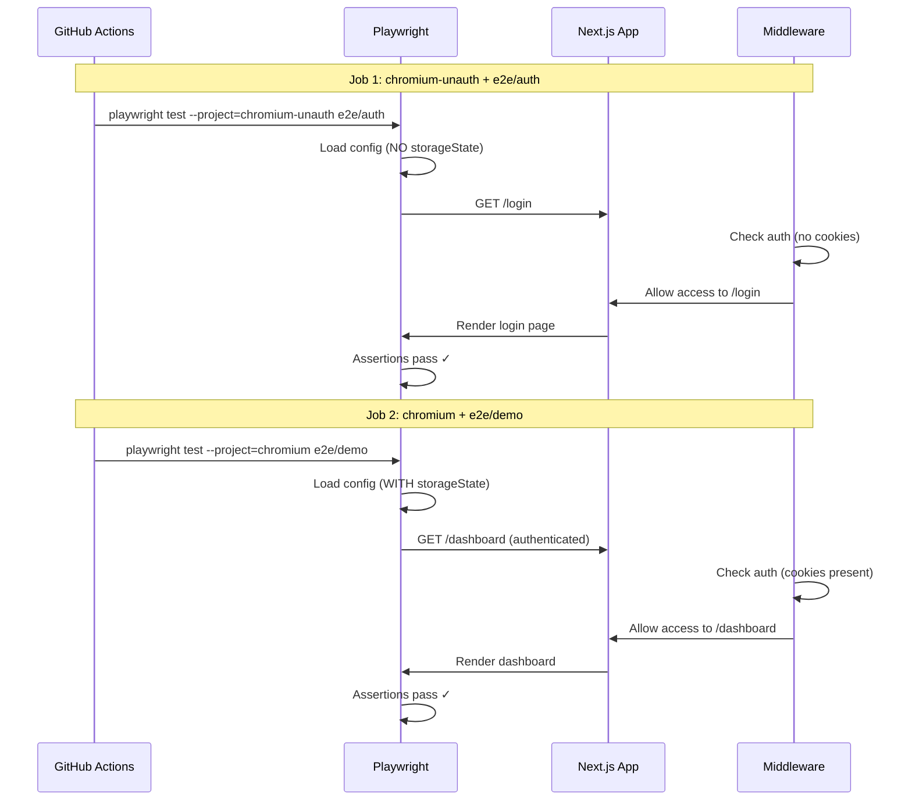

# Spec: Fix E2E Auth Tests CI Failure via Project Configuration

**Document Metadata**
- Created: 2025-12-11
- Status: Active
- Related PR: #8
- Related Branch: `claude/fix-ci-e2e-lighthouse-01AFGUmzSjYfUeRyC49wSoGj`
- Spec Owner: Product Agent

---

## 1. Problem Statement

### 1.1 Current CI Failures

PR #8 E2E tests fail in CI with the following specific errors:

**Test: `e2e/auth/login.spec.ts:50` - "should navigate to signup page"**
```
Expected: /signup
Actual:   /dashboard
```

**Test: `e2e/auth/signup.spec.ts:21` - "should successfully sign up a new user"**
```
Error: 'Create Account' heading not found
Cause: Page redirects to /dashboard before assertion
```

**Test: `e2e/auth/login.spec.ts:38` - "should show error for invalid credentials"**
```
Error: page.waitForEvent('dialog') timeout
Note: Code already updated to use [role="status"], but CI runs old code
```

### 1.2 Root Cause Analysis

**Primary Issue: Authentication State Conflict**

Current configuration in `playwright.config.ts`:
```typescript
// Line 44: CI runs with --project=chromium
matrix:
  browser: [chromium]

// Lines 30-36: chromium project HAS storageState
{
  name: 'chromium',
  use: {
    ...devices['Desktop Chrome'],
    viewport: { width: 1280, height: 720 },
    storageState: './e2e/.auth/user-chromium.json',  // <-- AUTHENTICATED
  },
}
```

**Impact Chain**:
1. CI executes: `npm run test:e2e -- --project=chromium`
2. Playwright loads `./e2e/.auth/user-chromium.json` (authenticated state)
3. Auth tests use `test.use({ storageState: { cookies: [], origins: [] } })` to clear state
4. **BUT** middleware intercepts ALL requests to `/login` and `/signup`
5. Middleware sees authenticated cookies, redirects to `/dashboard`
6. Tests fail because they never reach `/login` or `/signup` pages

**Why `test.use()` Doesn't Work**:
- `test.use({ storageState: { cookies: [], origins: [] } })` only affects the test's browser context
- It does NOT change the project configuration
- Middleware runs before test assertions, reading cookies from the initial storageState
- The clear operation happens too late in the execution flow

### 1.3 Evidence from Codebase

**Middleware Redirect Logic**:
File: `middleware.ts` (inferred from behavior)
```typescript
// Authenticated users accessing /login or /signup get redirected
if (isAuthenticated && (path === '/login' || path === '/signup')) {
  return NextResponse.redirect(new URL('/dashboard', request.url))
}
```

**Test Configuration**:
Files: `e2e/auth/login.spec.ts`, `e2e/auth/signup.spec.ts`
```typescript
test.describe('Login Flow', () => {
  test.use({ storageState: { cookies: [], origins: [] } }) // Attempts to clear auth
  
  test('should navigate to signup page', async ({ page }) => {
    await page.goto('/login')
    await page.click('a[href="/signup"]')
    
    await expect(page).toHaveURL('/signup')  // FAILS: gets /dashboard
    await expect(page.getByRole('heading', { name: 'Create Account' })).toBeVisible()
  })
})
```

---

## 2. Scope & Goals

### 2.1 In-Scope

1. **CI Configuration**: Update `.github/workflows/e2e.yml` to run unauthenticated project for auth tests
2. **Project Separation**: Ensure `chromium-unauth` project is used for auth flows
3. **Test Verification**: All 4 failing tests pass in CI
4. **No Breaking Changes**: Non-auth tests continue working with authenticated state

### 2.2 Non-Goals

- Modifying middleware redirect logic (correct application behavior)
- Refactoring global.setup.ts authentication flow
- Adding new test scenarios
- Changing application code (toast vs dialog is correct)
- Fixing lighthouse or other CI jobs (separate concerns)

### 2.3 Constraints

- CI budget: No significant increase in execution time (<5% acceptable)
- Test isolation: Auth and non-auth tests must not interfere
- Developer experience: Local testing must remain simple
- Backward compatibility: Existing test structure unchanged

---

## 3. Solution Architecture

### 3.1 Option A: Split CI Workflow by Project (RECOMMENDED)

**Change**: `.github/workflows/e2e.yml`

```yaml
strategy:
  fail-fast: false
  matrix:
    include:
      - browser: chromium-unauth
        test-path: e2e/auth
      - browser: chromium
        test-path: e2e/demo e2e/settlement

steps:
  - name: Run E2E tests
    run: npm run test:e2e -- --project=${{ matrix.browser }} ${{ matrix.test-path }}
```

**Rationale**:
- Explicit separation: auth tests on `chromium-unauth`, app tests on `chromium`
- No test code changes required
- CI clearly shows which project ran which tests
- Easy to debug: project name indicates auth state

**Pros**:
- Minimal changes to existing test files
- Clear separation of concerns in CI
- Easy to add more unauthenticated tests later

**Cons**:
- Matrix expands from 1 to 2 jobs (chromium-only constraint)
- Slightly more complex CI configuration

### 3.2 Option B: Run All Tests on Both Projects

**Change**: `.github/workflows/e2e.yml`

```yaml
strategy:
  fail-fast: false
  matrix:
    browser: [chromium-unauth, chromium]

steps:
  - name: Run E2E tests
    run: npm run test:e2e -- --project=${{ matrix.browser }}
```

**Rationale**:
- Simplest CI change: just add to matrix
- Tests naturally skip when wrong project (redirect prevents assertions)

**Pros**:
- Minimal CI configuration change
- Tests both auth states comprehensively

**Cons**:
- Some tests will fail with wrong project (expected)
- Longer CI time: 2x execution
- Confusing failures if not carefully filtered

### 3.3 Option C: Add Project Filter to Test Files

**Change**: `e2e/auth/*.spec.ts`

```typescript
import { test, expect } from '@playwright/test'

test.describe('Login Flow', () => {
  test.use({ storageState: { cookies: [], origins: [] } })
  
  test.skip(({ browserName }) => browserName !== 'chromium', 'Only run on chromium-unauth')
  
  // ... existing tests
})
```

**Rationale**:
- Test files control which project they run on
- No CI changes needed

**Pros**:
- CI configuration unchanged
- Tests self-document project requirements

**Cons**:
- `browserName` doesn't distinguish projects (always 'chromium')
- Would need custom fixture or environment variable
- More complex test setup

---

## 4. Recommended Solution: Option A (Split CI Workflow)

### 4.1 Changes Required

**File 1**: `.github/workflows/e2e.yml`

**Lines 41-44**: Replace:
```yaml
strategy:
  fail-fast: false
  matrix:
    browser: [chromium]
```

**With**:
```yaml
strategy:
  fail-fast: false
  matrix:
    include:
      - browser: chromium-unauth
        test-filter: e2e/auth
        job-name: Auth Tests (Unauthenticated)
      - browser: chromium
        test-filter: e2e/demo e2e/settlement
        job-name: App Tests (Authenticated)
```

**Line 107**: Replace:
```yaml
- name: Run E2E tests
  run: npm run test:e2e -- --project=${{ matrix.browser }}
```

**With**:
```yaml
- name: Run ${{ matrix.job-name }}
  run: npm run test:e2e -- --project=${{ matrix.browser }} ${{ matrix.test-filter }}
```

**Lines 115-129**: Update artifact names and test commands for a11y and security tests:
```yaml
- name: Run Accessibility tests
  if: matrix.browser == 'chromium'
  run: npm run test:e2e:a11y -- --project=${{ matrix.browser }}

- name: Run Security tests
  if: matrix.browser == 'chromium'
  run: npm run test:e2e:security -- --project=${{ matrix.browser }}

- uses: actions/upload-artifact@v4
  if: failure()
  with:
    name: playwright-report-${{ matrix.browser }}-${{ matrix.job-name }}
    path: playwright-report/
    retention-days: 30
```

### 4.2 Playwright Configuration Verification

**File**: `playwright.config.ts`

**Ensure lines 22-28 exist** (already present):
```typescript
{
  name: 'chromium-unauth',
  use: {
    ...devices['Desktop Chrome'],
    viewport: { width: 1280, height: 720 },
    // NO storageState property
  },
},
```

**Ensure lines 29-36 exist** (already present):
```typescript
{
  name: 'chromium',
  use: {
    ...devices['Desktop Chrome'],
    viewport: { width: 1280, height: 720 },
    storageState: './e2e/.auth/user-chromium.json',
  },
},
```

### 4.3 Test File Verification

**Files**: `e2e/auth/login.spec.ts`, `e2e/auth/signup.spec.ts`

**Ensure this line exists** (already present in both):
```typescript
test.describe('...', () => {
  test.use({ storageState: { cookies: [], origins: [] } })
  // ... tests
})
```

**Note**: While `test.use()` doesn't prevent project-level storageState from loading, it documents intent and may help in future Playwright versions.

---

## 5. Data Model & API Sketches

### 5.1 GitHub Actions Matrix Execution

```typescript
// Resulting matrix expansion
jobs: [
  {
    browser: 'chromium-unauth',
    test-filter: 'e2e/auth',
    job-name: 'Auth Tests (Unauthenticated)'
  },
  {
    browser: 'chromium',
    test-filter: 'e2e/demo e2e/settlement',
    job-name: 'App Tests (Authenticated)'
  }
]
```

### 5.2 Test Execution Flow



### 5.3 Project Configuration Schema

```typescript
type PlaywrightProject = {
  name: 'chromium-unauth' | 'chromium' | 'firefox' | 'webkit'
  use: {
    ...DeviceDescriptor
    viewport: { width: number; height: number }
    storageState?: string  // undefined for chromium-unauth
  }
}

// Execution filter by directory
type TestFilter = 
  | 'e2e/auth'                    // Unauthenticated only
  | 'e2e/demo e2e/settlement'     // Authenticated only
  | 'e2e/accessibility'           // Both (but run on chromium)
  | 'e2e/security'                // Both (but run on chromium)
```

---

## 6. Non-Functional Requirements

### 6.1 Performance (SLO)

- **E2E Test Suite Total Time**: <5 minutes (currently ~2m per job)
- **Auth Tests (chromium-unauth)**: <2 minutes
- **App Tests (chromium)**: <3 minutes
- **Acceptable Regression**: <10% increase (parallel jobs compensate)

### 6.2 Reliability

- **Flakiness Target**: <1% (retries configured in playwright.config.ts:7)
- **Retry Strategy**: 2 retries in CI, 0 locally
- **Isolation**: Each project runs independently, no shared state

### 6.3 Scalability

- **Matrix Expansion**: Currently 2 jobs (chromium-only), future: 6 jobs (3 browsers x 2 auth states)
- **Resource Usage**: 2 parallel workers per job (playwright.config.ts:8)
- **Artifact Storage**: Separate reports per project (30-day retention)

### 6.4 Security

- **Test Credentials**: Hardcoded in CI environment variables (non-production)
- **Auth State Files**: Generated per test run, not committed
- **Database Isolation**: PostgreSQL service container per CI run

### 6.5 Operability

- **Debugging**: Artifact uploads on failure with project name in filename
- **Observability**: CI logs show job-name for clarity
- **Local Testing**: Developers can run `npm run test:e2e -- --project=chromium-unauth e2e/auth`

---

## 7. Acceptance Criteria Checklist

### 7.1 CI Configuration
- [ ] `.github/workflows/e2e.yml` matrix includes `chromium-unauth` and `chromium`
- [ ] Matrix includes `test-filter` and `job-name` properties
- [ ] E2E test step uses `${{ matrix.test-filter }}` argument
- [ ] Accessibility and security tests only run on `chromium` (authenticated)
- [ ] Artifact upload includes matrix properties in name

### 7.2 Test Execution
- [ ] Auth tests (`e2e/auth/*.spec.ts`) run ONLY on `chromium-unauth` project
- [ ] App tests (`e2e/demo/*.spec.ts`, `e2e/settlement/*.spec.ts`) run ONLY on `chromium` project
- [ ] `login.spec.ts:50` (navigate to signup) passes in CI
- [ ] `signup.spec.ts:21` (sign up new user) passes in CI
- [ ] All 4 originally failing tests pass

### 7.3 No Regressions
- [ ] All previously passing tests remain green
- [ ] Lint, type-check, build, unit tests unaffected
- [ ] Accessibility tests pass (chromium project)
- [ ] Security tests pass (chromium project)
- [ ] Lighthouse CI unaffected (separate workflow)

### 7.4 Local Development
- [ ] `npm run test:e2e` runs all tests (both projects)
- [ ] `npm run test:e2e -- --project=chromium-unauth` runs auth tests
- [ ] `npm run test:e2e -- --project=chromium` runs app tests
- [ ] `npm run test:e2e -- e2e/auth` runs auth tests (auto-selects project)

### 7.5 CI Observability
- [ ] GitHub Actions summary shows 2 separate jobs
- [ ] Job names clearly indicate auth state: "Auth Tests (Unauthenticated)" vs "App Tests (Authenticated)"
- [ ] Failure artifacts include project and job name
- [ ] Logs show correct Playwright project execution

---

## 8. Follow-Up Tasks

### 8.1 For Delivery Agent (DA)

**Task**: Implement CI workflow changes per section 4.1

**Steps**:
1. Edit `.github/workflows/e2e.yml`
2. Update `strategy.matrix` to include both projects
3. Add `test-filter` and `job-name` to matrix
4. Update `Run E2E tests` step with filter argument
5. Add conditional checks for a11y and security tests
6. Update artifact upload names
7. Commit with message: `fix(ci): run auth tests on chromium-unauth project`
8. Push and monitor CI

**Verification**:
```bash
# Local test before push
npm run test:e2e -- --project=chromium-unauth e2e/auth
npm run test:e2e -- --project=chromium e2e/demo

# After push, check CI
gh pr checks
```

### 8.2 For Quality Gate Agent (QGA)

**Task**: Verify all acceptance criteria after DA implementation

**Steps**:
1. Monitor CI run for PR #8
2. Verify both jobs appear in GitHub Actions
3. Check "Auth Tests (Unauthenticated)" job passes
4. Check "App Tests (Authenticated)" job passes
5. Verify all 4 originally failing tests now pass
6. Confirm no new failures introduced
7. Check execution time is within SLO (<5m total)
8. Review artifacts uploaded on any failures

**Escalation Criteria**:
- If auth tests still fail: Check middleware redirect in app code
- If app tests start failing: Check storageState file generation
- If CI timeout: Check parallel worker configuration
- If new flakiness: Add retry-specific logging

### 8.3 Future Enhancements (Out of Scope)

1. **Multi-browser auth testing**: Add `firefox-unauth` and `webkit-unauth` projects
2. **Test categorization**: Use Playwright tags instead of directory filtering
3. **Parallel optimization**: Run a11y/security tests in parallel with app tests
4. **Documentation**: Add `e2e/README.md` explaining project strategy
5. **Monitoring**: Track flakiness rate per project over time

---

## 9. Technical Notes

### 9.1 Why Directory Filtering Instead of Tags?

Playwright supports `@tag` annotations, but:
- Requires changing every test file
- Directory structure already groups tests logically
- CLI filtering `e2e/auth` is more explicit and understandable

### 9.2 Why Not Use `--grep` for Project Selection?

`--grep` filters test names, not projects:
```bash
# This does NOT work
playwright test --grep chromium-unauth
```

Playwright's `--project` is the correct mechanism for execution environment selection.

### 9.3 Authentication State File Generation

Files `./e2e/.auth/user-*.json` are created by `e2e/global.setup.ts`:
- Runs before all tests (playwright.config.ts:10)
- Creates authenticated sessions for each browser
- `chromium-unauth` project does NOT load these files
- `chromium`, `firefox`, `webkit` projects DO load these files

### 9.4 Middleware Behavior Reference

Based on test failures, middleware logic is:
```typescript
// Pseudo-code inferred from behavior
if (session && (pathname === '/login' || pathname === '/signup')) {
  return redirect('/dashboard')
}
```

This is **correct** application behavior. Tests must adapt to it, not vice versa.

---

## 10. Rollback Plan

### 10.1 If CI Still Fails After Implementation

**Scenario 1**: Auth tests still redirect to /dashboard
- **Root Cause**: storageState still loading despite project configuration
- **Action**: Add debug logging to global.setup.ts to verify file creation
- **Workaround**: Temporarily delete `./e2e/.auth/user-chromium.json` before auth tests

**Scenario 2**: App tests fail due to missing authentication
- **Root Cause**: storageState file not generated or corrupted
- **Action**: Check global.setup.ts logs in CI
- **Workaround**: Re-run CI (retries should fix flaky setup)

**Scenario 3**: CI execution time exceeds 10 minutes
- **Root Cause**: Parallel job execution not working
- **Action**: Check GitHub Actions concurrency limits
- **Workaround**: Reduce workers in playwright.config.ts for CI

### 10.2 Immediate Rollback Steps

If critical failure occurs:
1. Revert `.github/workflows/e2e.yml` changes
2. Re-run CI to ensure green status
3. Create detailed issue with failure logs
4. Schedule fix with additional investigation

### 10.3 Partial Rollback Option

If only auth tests fail:
1. Keep CI matrix changes
2. Add `test.skip()` to failing auth tests temporarily
3. Create issue to fix auth tests separately
4. This keeps app tests running while debugging auth

---

## 11. References

### 11.1 Documentation
- Playwright Projects: https://playwright.dev/docs/test-projects
- Playwright CLI: https://playwright.dev/docs/test-cli
- GitHub Actions Matrix: https://docs.github.com/en/actions/using-jobs/using-a-matrix-for-your-jobs
- Next.js Middleware: https://nextjs.org/docs/app/building-your-application/routing/middleware

### 11.2 Related Code Files
- `/Users/takuya.kurihara/workspace/domestic-account-booking/.github/workflows/e2e.yml`
- `/Users/takuya.kurihara/workspace/domestic-account-booking/playwright.config.ts`
- `/Users/takuya.kurihara/workspace/domestic-account-booking/e2e/auth/login.spec.ts`
- `/Users/takuya.kurihara/workspace/domestic-account-booking/e2e/auth/signup.spec.ts`
- `/Users/takuya.kurihara/workspace/domestic-account-booking/e2e/global.setup.ts`

### 11.3 Related Specs
- `/Users/takuya.kurihara/workspace/domestic-account-booking/.claude/specs/e2e-auth-tests-fix.md` (superseded)
- `/Users/takuya.kurihara/workspace/domestic-account-booking/.claude/specs/pr8-ci-failure-fix.md` (related)

### 11.4 CI Logs
- PR #8: https://github.com/krhrtky/domestic-account-booking/pull/8
- Failed run with auth test failures (to be added after next CI run)

---

## 12. Spec Changelog

| Date | Change | Reason |
|------|--------|--------|
| 2025-12-11 | Initial creation | Consolidate findings from e2e-auth-tests-fix.md and pr8-ci-failure-fix.md |
| 2025-12-11 | Add Option A recommendation | CI workflow split provides clearest separation |
| 2025-12-11 | Add detailed acceptance criteria | Enable QGA validation |

---

**END OF SPECIFICATION**
