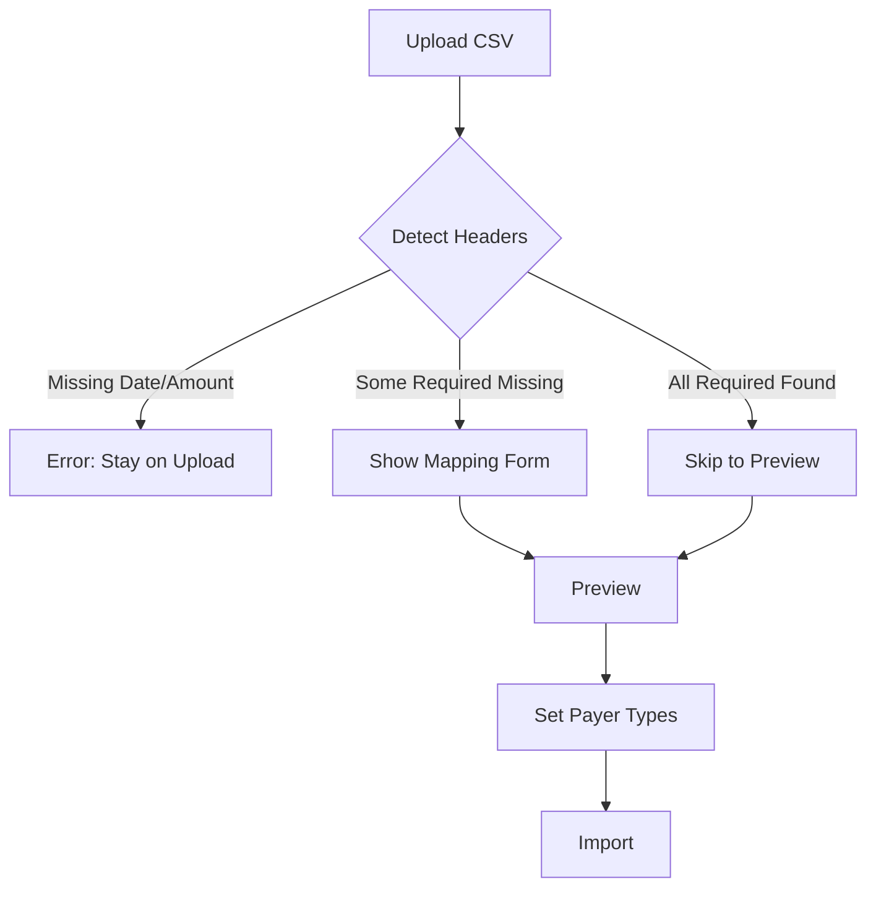
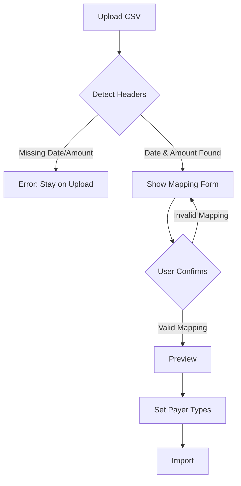

# CSV Column Mapping Feature - Spec & Acceptance

## Scope

### Included
- Always show column mapping step after CSV file upload
- Pre-fill mapping form with auto-detected column suggestions
- Allow users to verify and modify column mappings before preview
- Maintain all existing auto-detection logic
- Preserve sensitive column filtering (per L-LC-001)
- Keep all security measures (CSV injection prevention per L-SC-002)

### Changes
- Remove conditional logic that skips mapping step when all fields auto-detected
- Simplify step flow: `upload → mapping → preview → import`
- Single file modification: `CSVUploadForm.tsx` (lines 93-114)

## Non-Goals

- Saving user column mapping preferences
- Showing sample CSV data in mapping form
- Supporting multi-file uploads
- Creating column mapping templates
- Changing auto-detection algorithms
- Modifying CSV parsing logic
- Altering security sanitization rules

## Constraints

### Business Rules (per L-BR-006)
- Required CSV columns: Date, Amount, Description
- Optional CSV column: Payer
- File size limit: 5MB (no change)
- Row count limit: 10,000 rows (no change)
- Supported encoding: UTF-8 with/without BOM
- Delimiter: Comma (,)
- Header row: Required

### Security (per L-SC-002, L-LC-001)
- Formula injection prevention: Escape `=`, `+`, `-`, `@` prefixes
- Newline injection prevention: Remove `\r\n` from fields
- Sensitive column exclusion: Auto-filter card/account number columns
- No logging of sensitive data during mapping

### User Experience (per L-CX-002, L-CX-003, L-CX-004)
- All error messages in Japanese
- Error messages must be specific and actionable
- UI feedback within 100ms for user actions
- Consistent formatting for dates, amounts, percentages
- No technical error messages exposed to users

### Legal Compliance (per L-LC-001)
- Minimal PII collection
- Automatic exclusion of columns matching sensitive patterns:
  - カード番号, Card Number, card number
  - 口座番号, Account Number, account number
  - 暗証番号, PIN, CVV, CVC

## Technical Design

### Current Flow


### Proposed Flow


### Component Changes

**File:** `/Users/takuya.kurihara/workspace/domestic-account-booking/src/components/transactions/CSVUploadForm.tsx`

**Before (Lines 93-114):**
```typescript
if (!hasDateColumn || !hasAmountColumn) {
  const missingColumns = []
  if (!hasDateColumn) missingColumns.push('日付')
  if (!hasAmountColumn) missingColumns.push('金額')
  setError(`必須列（${missingColumns.join('、')}）が見つかりません`)
  setStep('upload')
} else {
  const allRequiredFieldsMapped =
    result.suggestedMapping.dateColumn &&
    result.suggestedMapping.amountColumn &&
    result.suggestedMapping.descriptionColumn

  if (allRequiredFieldsMapped) {
    setStep('preview')
    await handlePreview(result.suggestedMapping, content, selectedFile.name)
  } else {
    setStep('mapping')
  }
}
```

**After:**
```typescript
if (!hasDateColumn || !hasAmountColumn) {
  const missingColumns = []
  if (!hasDateColumn) missingColumns.push('日付')
  if (!hasAmountColumn) missingColumns.push('金額')
  setError(`必須列（${missingColumns.join('、')}）が見つかりません`)
  setStep('upload')
} else {
  setStep('mapping')
}
```

**Lines Changed:** ~12 lines deleted, net reduction of complexity

### Data/API Changes

No data model or API changes required:
- `ColumnMapping` interface unchanged
- `parseCSV` function signature unchanged
- Database schema unchanged
- API endpoints unchanged

## Non-Functional Requirements

### Performance (per L-CX-004)
| Operation | Target | Expected |
|-----------|--------|----------|
| Display mapping form | 100ms | ~50ms (React render) |
| Dropdown interaction | 100ms | <10ms (state update) |
| Form validation | 100ms | <5ms (synchronous) |
| Preview generation | 3s | ~500ms (existing) |

### Security (per L-SC-001, L-SC-002)
- Authentication required for all CSV upload endpoints
- Group membership verified before import
- CSRF token required for state-changing operations
- Rate limiting: 10 uploads per minute per user

### Scalability (per L-RV-002)
- File size: 5MB max (unchanged)
- Row count: 10,000 max (unchanged)
- Memory usage: No increase (same parsing logic)
- CPU usage: Negligible (removed async call in one path)

### Operability
- No new environment variables
- No database migrations
- No infrastructure changes
- Rollback: Single file revert
- Monitoring: Existing error tracking continues

## Acceptance Criteria

### AC-1: Mapping Step Visibility (per L-CX-004)
- [ ] Mapping form displays within 100ms after successful file upload
- [ ] Form shows all detected CSV headers in dropdown options
- [ ] Auto-detected values are pre-filled in all dropdowns
- [ ] Required fields show red asterisk (*)
- [ ] Optional payer field shows "(任意)" label

### AC-2: User Column Selection (per L-BR-006)
- [ ] User can select date column from available headers
- [ ] User can select amount column from available headers
- [ ] User can select description column from available headers
- [ ] User can select payer column or choose "なし"
- [ ] Changing selection updates validation immediately

### AC-3: Validation (per L-CX-003)
- [ ] Error shown when date column is not selected
- [ ] Error shown when amount column is not selected
- [ ] Error shown when description column is not selected
- [ ] Error message: "必須列（日付、金額、摘要）を選択してください。"
- [ ] No error when payer column is "なし" (optional)
- [ ] "プレビューを表示" button disabled when validation fails
- [ ] "プレビューを表示" button enabled when all required fields selected

### AC-4: Auto-Detection (per L-BR-006)
- [ ] System detects "日付", "Date", "date", "利用日" as date column
- [ ] System detects "金額", "Amount", "amount", "利用金額" as amount column
- [ ] System detects "摘要", "Description", "description", "内容", "メモ" as description
- [ ] System detects "支払者", "Payer", "User", "ユーザー" as payer column
- [ ] Detection is case-insensitive
- [ ] Detection works with Japanese and English headers

### AC-5: Sensitive Data Protection (per L-LC-001)
- [ ] "カード番号" column is excluded from headers list
- [ ] "Card Number" column is excluded from headers list
- [ ] "口座番号" column is excluded from headers list
- [ ] "Account Number" column is excluded from headers list
- [ ] PIN, CVV, CVC columns are excluded from headers list
- [ ] Warning message shown: "機密情報を含む可能性のある列を除外しました: [列名]"
- [ ] Excluded columns not available in any dropdown

### AC-6: Security Sanitization (per L-SC-002)
- [ ] Fields starting with `=` are prefixed with `'` during parsing
- [ ] Fields starting with `+` are prefixed with `'` during parsing
- [ ] Fields starting with `-` are prefixed with `'` during parsing
- [ ] Fields starting with `@` are prefixed with `'` during parsing
- [ ] Newline characters (`\r\n`) are removed from all fields
- [ ] Sanitization applies to description and payer_name fields

### AC-7: Preview Accuracy
- [ ] Preview uses user-confirmed column mapping (not auto-detected if changed)
- [ ] Date values are correctly parsed and normalized to YYYY-MM-DD
- [ ] Amount values are correctly parsed (comma/yen symbol removed)
- [ ] Description values are correctly sanitized
- [ ] Payer name is populated when payer column is selected
- [ ] source_file_name is correctly set to uploaded filename

### AC-8: Error Handling (per L-CX-003)
- [ ] Upload step error when date column cannot be auto-detected
- [ ] Upload step error when amount column cannot be auto-detected
- [ ] Error message: "必須列（日付、金額）が見つかりません"
- [ ] Mapping step error when user deselects required column
- [ ] All error messages in Japanese
- [ ] No stack traces or technical errors shown to users

### AC-9: Navigation Flow
- [ ] "キャンセル" button returns to upload step
- [ ] "キャンセル" clears file selection
- [ ] "キャンセル" resets all form state
- [ ] "プレビューを表示" proceeds to preview step when valid
- [ ] "プレビューを表示" shows error message when invalid
- [ ] Back-to-back uploads follow same flow

### AC-10: Backwards Compatibility
- [ ] Standard CSV format (Date, Amount, Description) works as before
- [ ] Japanese CSV format (日付, 金額, 摘要) works as before
- [ ] CSV with payer column works as before
- [ ] Existing unit tests pass without modification
- [ ] Import result identical for same mapping choices

### AC-11: Performance (per L-CX-004)
- [ ] Mapping form renders in <100ms after file upload
- [ ] Dropdown click shows options in <100ms
- [ ] Validation feedback appears in <100ms after selection change
- [ ] "プレビューを表示" button shows loading state in <100ms

### AC-12: UI Consistency (per L-CX-002)
- [ ] Form styling matches existing design system
- [ ] Dropdowns use consistent border/padding/font
- [ ] Buttons follow brand color scheme
- [ ] Error messages use semantic-error color
- [ ] Required field asterisks use semantic-error color
- [ ] Disabled button state is visually distinct

## Follow-up Tasks/Issues for Delivery Agent

### Implementation
1. Modify `CSVUploadForm.tsx` lines 93-114 as specified
2. Test with sample CSV files from `tests/fixtures/`
3. Verify no regression in existing unit tests

### Quality Gate
1. Run `npm test` - all tests must pass
2. Run `npm run type-check` - no TypeScript errors
3. Run `npm run lint` - no linting errors
4. Manual test: Upload CSV with standard headers → verify mapping shown
5. Manual test: Upload CSV with Japanese headers → verify mapping shown
6. Manual test: Change mapping selections → verify preview uses new mapping
7. Manual test: Upload CSV with sensitive columns → verify exclusion warning

### E2E Testing
1. Add E2E test: "allows manual column mapping override"
2. Update E2E test: Remove expectation of direct jump to preview
3. Verify: CSV upload happy path still passes

### Documentation
1. Update user guide with mapping step screenshots (if applicable)
2. No API documentation changes needed
3. No database schema documentation changes needed

## Related Laws References

- **L-BR-006:** CSV Import Rules (full specification)
- **L-LC-001:** PII Handling in CSV (sensitive column filtering)
- **L-SC-002:** CSV Injection Prevention (formula/newline sanitization)
- **L-CX-002:** UI Display Consistency (formatting standards)
- **L-CX-003:** Error Message Clarity (Japanese, specific, actionable)
- **L-CX-004:** Feedback Immediacy (100ms UI response)
- **L-RV-002:** Infrastructure Cost Control (file/row limits)

## Definition of Done

- [ ] Code changes committed to feature branch
- [ ] All unit tests pass (`npm test`)
- [ ] Type checking passes (`npm run type-check`)
- [ ] Linting passes (`npm run lint`)
- [ ] Manual testing completed with 3+ CSV formats
- [ ] E2E tests updated and passing
- [ ] Code review approved
- [ ] Merged to main branch
- [ ] Deployed to staging environment
- [ ] Smoke tested on staging
- [ ] Deployed to production
- [ ] Production smoke test completed
